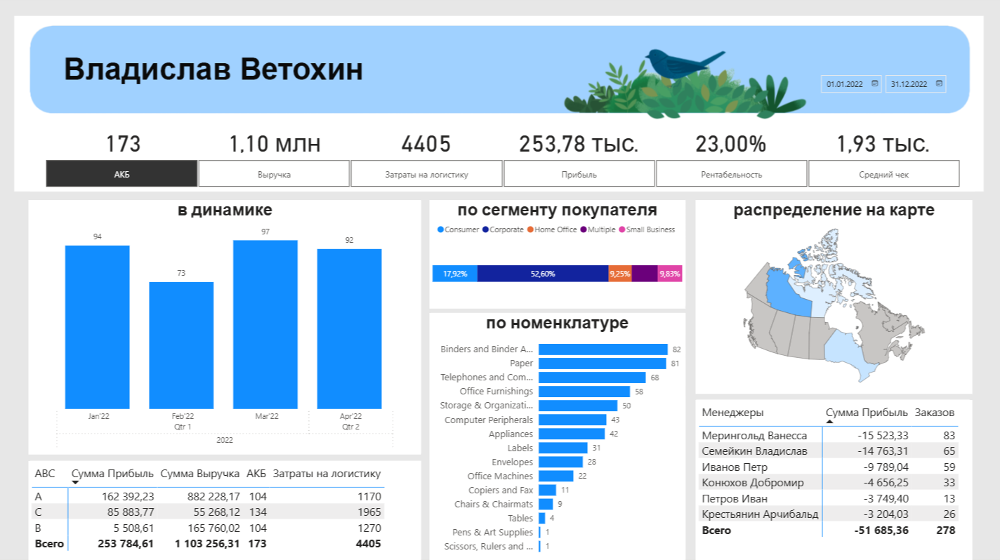

# Аналитический дашборд

## Основные рассчитанные показатели (Measures)
- Выручка
- Прибыль
- Рентабельность
- Доля выкупа (АКБ)
- Средний чек
- Затраты на логистику

## Построенные визуализации
- Динамика ключевых показателей по временным периодам
- Сравнение метрик по сегментам покупателей
- Ассортиментная аналитика (дрилл-даун):
  - Категория → Подкатегория → Номенклатура
- Геораспределение показателей на карте
- ABC-анализ номенклатуры

## Табличная аналитика
- Менеджеры с продажами в отрицательную прибыль
- Количество заказов с отрицательной маржой по каждому менеджеру

## UX / UI особенности
- Все кнопки интерактивны (кликабельны)
- Связанные фильтры (cross-filtering)
- Возможность детального проваливания в данные

## Приложенные материалы
С полной логикой расчётов, мерами и метриками можно ознакомиться в файле `Коммерческий дашборд.pbix`.
