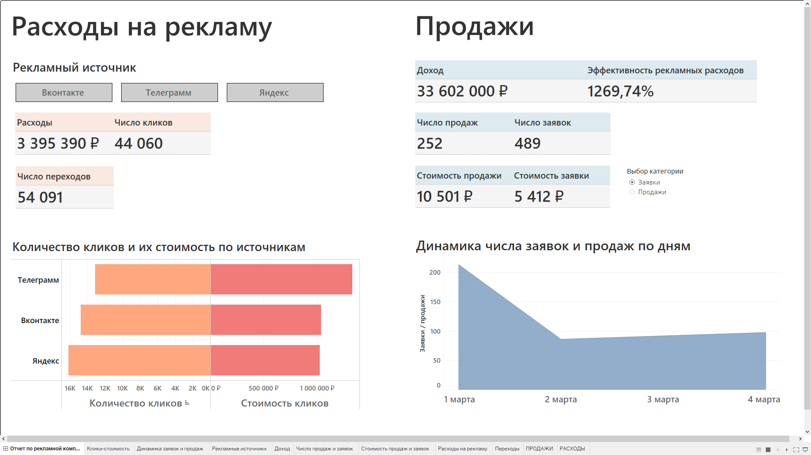

# Проект: Отчет по рекламной кампании в Tableau

Цель проекта — построить дашборд в Tableau для анализа рекламной кампании. Основные задачи:  
- Рассчитать ключевые метрики (CPC, CPL, CPA, ROAS).  
- Отследить рекламные источники, их расходы и клики.  
- Проанализировать заявки, стоимость заявки и продажи.  
- Сравнить эффективность каналов (Яндекс, VK, TG).  

## Структура проекта

Дашборд делится на две логические части: расходы на рекламу и доходы по источникам.  
Кнопки по источникам кликабельные — можно выбрать сразу несколько категорий.  
Посмотреть опубликованный дашборд на Tableau Public можно, нажав на картинку ниже.

---

## Дашборд Tableau

**Примечание:** дашборд корректно отображается только во весь экран при масштабе 100% в Windows.

---

## Использованные данные

Источник данных — Excel-файл с информацией о рекламных кампаниях:  
- список рекламных каналов
- расходы и количество кликов
- заявки и продажи  

Данные агрегированы, без детализации по пользователям.